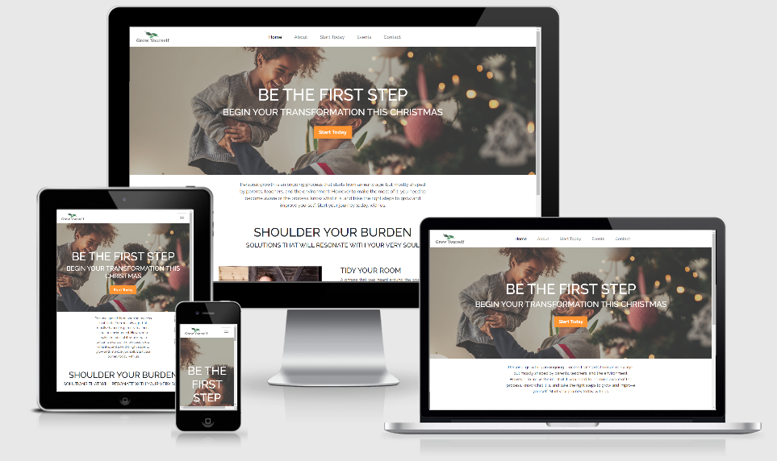

# Grow Yourself Website
This website was created for people who are looking to improve their lives and work on personal development. It allows them to browse resources to get started with their first steps and to register for events being held by the worlds best personal development coaches.

[View the live website here.](https://sreninc.github.io/grow-yourself/)



## Table of Contents
1. [User Experience](#user-experience-ux)
2. [Features](#features)
3. [Testing](#testing)
4. [Deployment](#deployment)
5. [Credits](#credits)

## User Experience (UX)
* User stories
    * Visitor Goals
        1. As a visitor looking to start learning about personal growth I want to be able to access resources that I can use straight away or order for use later.
        1. As a visitor looking to attend events about personal growth I want to be able to register for events that I can attend in person or online.
        1. As a visitor who is unsure of what to do I want to be able to contact someone to give me advice and help me find the right path.
    * Site Owner Goals
        1. As the owner of the site I want people to access the get started resources and make a purchase through our affiliate links.
        1. As the owner of the site I want people to register for events that we will make commission or direct revenue from.
        1. As the owner of the site I want people who are unsure of what to do or who have questions to contact us so we can guide them and also collect their contact information for our newsletter.
    * Goal Screenshots From Finished Website    
        1. [Access Resources](assets/images/ux-stories/access-resources.png)
        1. [Access Events](assets/images/ux-stories/access-events.png)
        1. [Access Contact](assets/images/ux-stories/access-contact.png)
* Design
    * Colour Scheme
        * The two main color used by Grow Yourself is orange used in all CTAs. The websites aesthetic is designed to be clean and crisp with images that emphasise beginnings and growth.  
    * Typography
        * The font style used throughout the site is Raleway from Google Fonts.
    * Imagery
        * Imagery is important. The large, background hero image is designed to be striking, catch the user's attention and convey the feeling of new beginnings and growth. It also has a modern, energetic aesthetic.
    * Medium - Large Screen Mockups
        * [Homepage](assets/images/mockups/index.png)
        * [About](assets/images/mockups/about.png)
        * [Start Today](assets/images/mockups/start-today.png)
        * [Events](assets/images/mockups/events.png)
        * [Contact](assets/images/mockups/contact.png)
    * Tiny - Small Screen Mockups
        * [Homepage](assets/images/mockups/mobile-index.png)
        * [About](assets/images/mockups/mobile-about.png)
        * [Start Today](assets/images/mockups/mobile-start-today.png)
        * [Events](assets/images/mockups/mobile-events.png)
        * [Contact](assets/images/mockups/mobile-contact.png)
    
## Features
- [x] **Header** - allows user to easily navigate across all pages on any device
    - The brand logo is positioned on the left and is visible on all pages, when clicked it will bring the user back to the homepage.
    - Navigation links are in the middle of the header on desktop and stacked left aligned in a dropdown menu on smaller screens.
    - When changing pages the appropriate link will be underlined so the user knows which page they are on.
    - When hovered over navigation links change color and the mouse changes to pointer so the user knows they can click the link.
- [x] **Page Banner**
    - Each page has a banner with a hero image, title text and CTA on some pages.
    - The text background has an opaque black background with low opacity to ensure the text is easily legible.
    - The banner explainer text is responsive to avoid overspilling.
- [x] **Accessibility**
    - All images have alternative text.
    - The hamburger menu has aria-label so users with screen readers know the menu is there.
- [x] **Buttons**
    - Primary buttons will change text color on hover and mouse to pointer to encourage clicks by users.
    - Secondary buttons for events and start today items will change background color and text color on hover and mouse to pointer to encourage clicks by users while ensuring the buttons don't overwhelm users.
- [x] **Responsiveness**
    - All Pages are responsive with the same functionality regardless of the device.
- [x] **Footer**
    - Footer has been designed to be at the bottom of the page, regardless of the amount of content.
    - All content has been spaced out to mirror the navigation links in the header creating an intuitive position.
    - Social links have been grouped together and the individual social media links change color to orange on hover.
    - The order of elements in the footer changes depending on the screen size to ensure a clean and consisten user experience across devices
- [x] **Landing Page**
    - Two CTA buttons to bring the user to the events page or start today page to access resources / book events.
- [x] **Start Today**
    - Responsive blocks for resources that link out to external sites in a new tab when clicked
- [x] **Events**
    - Responsive event blocks with images that when clicked open a pop up modal center screen with form for users to sign up for event.
- [x] **Contact**
    - A contact form for users to get in touch with a topic dropdown to direct the query to the right person. When submitted it reloads the contact page. 

### Future Features
- [ ] Submittable forms that will generate emails to the site owner and site user on submission.
- [ ] A login for users to allow downloadable resources monitored by the site.
- [ ] The option for users to rate and comment on resources and events.

### Languages Used

-   [HTML5](https://en.wikipedia.org/wiki/HTML5)
-   [CSS3](https://en.wikipedia.org/wiki/Cascading_Style_Sheets)

### Frameworks, Libraries & Programs Used

1. [Bootstrap 4.5.3:](https://getbootstrap.com/docs/4.5/getting-started/introduction/)
    - Bootstrap was used to assist with the responsiveness and styling of the website.
1. [Google Fonts:](https://fonts.google.com/)
    - Google fonts were used to import the 'Raleway' font into the style.css file which is used on all pages throughout the project.
1. [Font Awesome:](https://fontawesome.com/)
    - Font Awesome was used on some pages of the website to add icons for aesthetic and UX purposes as well as for the websites favicon.
1. [jQuery:](https://jquery.com/)
    - jQuery came with Bootstrap to make the navbar responsive but was also used for the smooth scroll function in JavaScript.
1. [Git](https://git-scm.com/)
    - Git was used for version control by utilizing the Gitpod terminal to commit to Git and Push to GitHub.
1. [GitHub:](https://github.com/)
    - GitHub is used to store the projects code after being pushed from Git.
1. [Figma:](https://www.figma.com/)
    - Figma was used to created the [mockups](https://www.figma.com/file/A1ChicG7Wxh3EdnqN23oYN/CodeInstitute-Milestone-Project-1?node-id=39%3A168) during the design process.
1. [Tiny PNG](https://tinypng.com/)
    - Tiny PNG was used to optimze jpg and png images used across the site.

## Testing

The W3C Markup Validator and W3C CSS Validator Services were used to validate every page of the project to ensure there were no syntax errors in the project.

-   [W3C CSS Validator](https://jigsaw.w3.org/css-validator/#validate_by_input) - [Results](https://jigsaw.w3.org/css-validator/validator?uri=https%3A%2F%2Fsreninc.github.io%2Fgrow-yourself%2Fassets%2Fcss%2Fstyle.css&profile=css3svg&usermedium=all&warning=1&vextwarning=&lang=en)
-   [W3C Markup Validator](https://jigsaw.w3.org/css-validator/#validate_by_input)
    - [Homepage](https://validator.w3.org/nu/?showsource=yes&showoutline=yes&showimagereport=yes&useragent=Validator.nu%2FLV+http%3A%2F%2Fvalidator.w3.org%2Fservices&acceptlanguage=&doc=https%3A%2F%2Fsreninc.github.io%2Fgrow-yourself%2F)
    - [About](https://validator.w3.org/nu/?showsource=yes&showoutline=yes&showimagereport=yes&doc=https%3A%2F%2Fsreninc.github.io%2Fgrow-yourself%2Fabout.html)
    - [Start Today](https://validator.w3.org/nu/?showsource=yes&showoutline=yes&showimagereport=yes&doc=https%3A%2F%2Fsreninc.github.io%2Fgrow-yourself%2Fstart-today.html)
    - [Events](https://validator.w3.org/nu/?showsource=yes&showoutline=yes&showimagereport=yes&doc=https%3A%2F%2Fsreninc.github.io%2Fgrow-yourself%2Fevents.html)
    - [Contact](https://validator.w3.org/nu/?showsource=yes&showoutline=yes&showimagereport=yes&doc=https%3A%2F%2Fsreninc.github.io%2Fgrow-yourself%2Fcontact.html)

The [Lighthouse](https://developers.google.com/web/tools/lighthouse/) chrome dev tool was used to check quality issues on all pages on desktop and mobile. Results were used to improve performance as much as possible. Final results are below.
-  Desktop
    - [Homepage](https://sreninc.github.io/grow-yourself/assets/tests/desktop-index.html)
    - [About](https://sreninc.github.io/grow-yourself/assets/tests/desktop-about.html)
    - [Start Today](https://sreninc.github.io/grow-yourself/assets/tests/desktop-start-today.html)
    - [Events](https://sreninc.github.io/grow-yourself/assets/tests/desktop-events.html)
    - [Contact](https://sreninc.github.io/grow-yourself/assets/tests/desktop-contact.html)
-  Mobile
    - [Homepage](https://sreninc.github.io/grow-yourself/assets/tests/mobile-index.html)
    - [About](https://sreninc.github.io/grow-yourself/assets/tests/mobile-about.html)
    - [Start Today](https://sreninc.github.io/grow-yourself/assets/tests/mobile-start-today.html)
    - [Events](https://sreninc.github.io/grow-yourself/assets/tests/mobile-events.html)
    - [Contact](https://sreninc.github.io/grow-yourself/assets/tests/mobile-contact.html)

### Further Testing

-   The Website was tested on Google Chrome, Internet Explorer, Microsoft Edge, Ecosia and Safari browsers.
-   The website was viewed on a variety of devices such as Desktop, Laptop, iPhone7, Samsung Galaxy Pro & iPad2.
-   All links were tested on each page to ensure that they functioned as expected.
-   Page load speeds were tested on the devices mentioned above using mobile and broadband internet to ensure satisfactory user experience.
-   Friends, colleagues and fellow students were asked to review the site and documentation to point out any bugs and/or user experience issues.

### Known Bugs

-   15.11.2020 iPhone 7 testing on Safari & Ecosia shows the nav bar turns transparent. Cannot replicate on chrome dev tools or other windows emulators to troubleshoot. Have tried 4 different fixes to no avail.

## Deployment

### GitHub Pages

The project was deployed to GitHub Pages using the following steps...

1. Log in to GitHub and locate the [GitHub Repository](https://github.com/sreninc/grow-yourself)
2. At the top of the Repository (not top of page), locate the "Settings" Button on the menu.
    - Alternatively Click [Here](https://raw.githubusercontent.com/) for a GIF demonstrating the process starting from Step 2.
3. Scroll down the Settings page until you locate the "GitHub Pages" Section.
4. Under "Source", click the dropdown called "None" and select "Master Branch".
5. The page will automatically refresh.
6. Scroll back down through the page to locate the now published site [link](https://sreninc.github.io/grow-yourself/) in the "GitHub Pages" section.

### Forking the GitHub Repository

By forking the GitHub Repository we make a copy of the original repository on our GitHub account to view and/or make changes without affecting the original repository by using the following steps...

1. Log in to GitHub and locate the [GitHub Repository](https://github.com/sreninc/grow-yourself)
2. At the top of the Repository (not top of page) just above the "Settings" Button on the menu, locate the "Fork" Button.
3. You should now have a copy of the original repository in your GitHub account.

### Making a Local Clone

1. Log in to GitHub and locate the [GitHub Repository](https://github.com/sreninc/grow-yourself)
2. Under the repository name, click the "Code" button and a dropdown menu will appear.
3. To clone the repository using HTTPS, under "Clone with HTTPS", copy the link.
4. Open Git Bash
5. Change the current working directory to the location where you want the cloned directory to be made.
6. Type `git clone`, and then paste the URL you copied in Step 3.

```
$ git clone https://github.com/YOUR-USERNAME/YOUR-REPOSITORY
```

7. Press Enter. Your local clone will be created.

```
$ git clone https://github.com/YOUR-USERNAME/YOUR-REPOSITORY
> Cloning into `CI-Clone`...
> remote: Counting objects: 10, done.
> remote: Compressing objects: 100% (8/8), done.
> remove: Total 10 (delta 1), reused 10 (delta 1)
> Unpacking objects: 100% (10/10), done.
```

Click [Here](https://help.github.com/en/github/creating-cloning-and-archiving-repositories/cloning-a-repository#cloning-a-repository-to-github-desktop) to retrieve pictures for some of the buttons and more detailed explanations of the above process.

## Credits

### Code

-   The full-screen hero image code came from this [StackOverflow post](https://stackoverflow.com)

-   [Bootstrap4](https://getbootstrap.com/docs/4.4/getting-started/introduction/): Bootstrap Library used throughout the project mainly to make site responsive using the Bootstrap Grid System.

-   [MDN Web Docs](https://developer.mozilla.org/) : For Pattern Validation code. Code was modified to better fit my needs and to match an Irish phone number layout to ensure correct validation. Tutorial Found [Here](https://developer.mozilla.org/en-US/docs/Web/HTML/Element/input/tel#Pattern_validation)

### Content

-   All content was written by the developer.

### Media

- Images used from [Unplash](https://unsplash.com) with credits to:
  - [Noah Buscher](https://unsplash.com/@noahbuscher?utm_source=unsplash&amp;utm_medium=referral&amp;utm_content=creditCopyText)
  - [Jukan Tateisi](https://unsplash.com/@tateisimikito?utm_source=unsplash&amp;utm_medium=referral&amp;utm_content=creditCopyText)
  - [Charles Deluvio](https://unsplash.com/@charlesdeluvio?utm_source=unsplash&amp;utm_medium=referral&amp;utm_content=creditCopyText)
  - [Joshua Ness](https://unsplash.com/@theexplorerdad?utm_source=unsplash&amp;utm_medium=referral&amp;utm_content=creditCopyText)
  - [Taylor Hernandez](https://unsplash.com/@taylormae?utm_source=unsplash&amp;utm_medium=referral&amp;utm_content=creditCopyText)

- Images used from speakers websites with credits to:
  - [Tony Robbins](https://www.tonyrobbins.com/)
  - [Jordan Peterson](https://www.jordanbpeterson.com/)


### Acknowledgements

-   My Mentor, Maranatha Ilesanmi,  for continuous helpful feedback and guidance.

-   Tutor support at Code Institute for their support.

-   Fellow Code Institute students for their feedback and suggestions.
